<div align="center">



<br/>

[](https://git.io/typing-svg)

<br/>

*Building scalable web applications & solving algorithmic problems — one commit at a time.*

<br/>


&nbsp;
[](https://github.com/surajgupta007)

</div>

---

## 🧑‍💻 About Me


I'm a **passionate Full Stack Developer** who loves crafting modern, performant web applications from the ground up. Whether it's architecting a scalable backend API or polishing a pixel-perfect UI, I enjoy the full journey of product development.

- 🔭 &nbsp; Currently building full-stack apps with **Node.js + Angular**
- 🌱 &nbsp; Exploring **Kubernetes**, **System Design**, and **DSA**
- 💡 &nbsp; Love solving competitive programming problems on **LeetCode**
- 🛠️ &nbsp; Passionate about **clean code**, **DevOps**, and **cloud infrastructure**
- 💬 &nbsp; Ask me about anything **JavaScript**, **Java**, or **DSA**
- ⚡ &nbsp; Fun fact: I debug with `console.log` and I'm not ashamed 😄

<br clear="right"/>

---

## 🛠️ Tech Stack

<div align="center">

### 💻 Programming Languages
[](https://skillicons.dev)

### 🎨 Frontend
[](https://skillicons.dev)

### ⚙️ Backend
[](https://skillicons.dev)

### 🗄️ Databases
[](https://skillicons.dev)

### ☁️ DevOps & Cloud
[](https://skillicons.dev)

### 🧰 Tools
[](https://skillicons.dev)

</div>

---

## 📊 GitHub Stats

<div align="center">

<a href="https://github.com/surajgupta007">
  
  &nbsp;&nbsp;
  
</a>

<br/><br/>


</div>

---

## 🏆 GitHub Achievements

<div align="center">

[](https://github.com/ryo-ma/github-profile-trophy)

</div>

---

## 📈 Contribution Graph

<div align="center">

[](https://github.com/ashutosh00710/github-readme-activity-graph)

</div>

---

## 🐍 Contribution Snake

<div align="center">

<picture>
  <source media="(prefers-color-scheme: dark)" srcset="https://raw.githubusercontent.com/surajgupta007/surajgupta007/output/github-contribution-grid-snake-dark.svg" />
  <source media="(prefers-color-scheme: light)" srcset="https://raw.githubusercontent.com/surajgupta007/surajgupta007/output/github-contribution-grid-snake.svg" />
  
</picture>

</div>

---

## 🌐 Connect With Me

<div align="center">

[](https://github.com/surajgupta007)
&nbsp;
[](https://linkedin.com/in/surajgupta007)
&nbsp;
[](https://leetcode.com/surajkgupta)

</div>

---

<div align="center">

### 💭 Dev Quote of the Day

[](https://github.com/piyushsuthar/github-readme-quotes)

<br/>

```
╔══════════════════════════════════════════════════╗
║  "First, solve the problem. Then, write the code." ║
║                          — John Johnson            ║
╚══════════════════════════════════════════════════╝
```

<br/>


</div>
